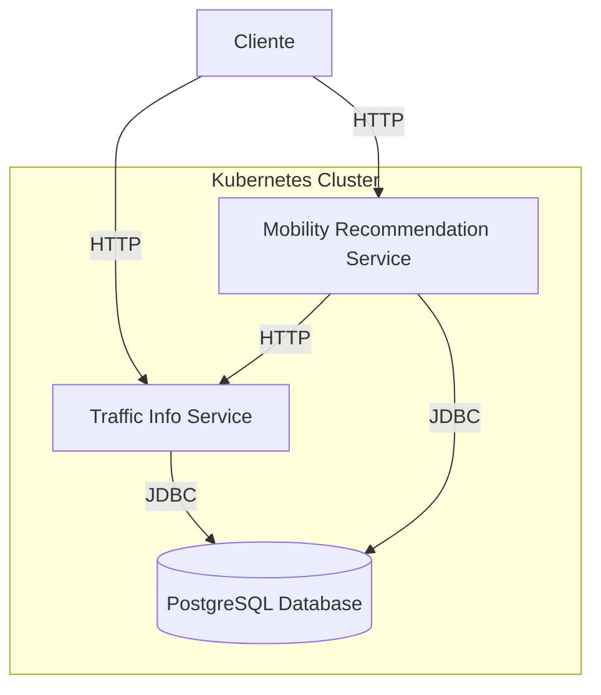

# Documentação do Projeto de Mobilidade Urbana

## 1. Arquitetura dos Microsserviços

O projeto é composto por três componentes principais:

1. **Traffic Info Service**: Responsável por gerenciar informações de tráfego.
2. **Mobility Recommendation Service**: Responsável por fornecer recomendações de mobilidade com base nas informações de tráfego.
3. **PostgreSQL Database**: Banco de dados relacional que armazena as informações de tráfego e recomendações de mobilidade.

Todos os serviços são desenvolvidos usando Spring Boot, e o banco de dados PostgreSQL é utilizado para persistência de dados. Os serviços se comunicam entre si através de chamadas HTTP REST e compartilham o mesmo banco de dados.

### Diagrama da Arquitetura



### Descrição dos Componentes

1. **Traffic Info Service**:

  1. Expõe endpoints REST para criar e recuperar informações de tráfego.
  2. Armazena e recupera dados do PostgreSQL.
  3. Porta padrão: 8080

2. **Mobility Recommendation Service**:

  1. Fornece recomendações de mobilidade baseadas em dados de tráfego.
  2. Comunica-se com o Traffic Info Service para obter informações atualizadas de tráfego.
  3. Armazena recomendações no PostgreSQL.
  4. Porta padrão: 8082

3. **PostgreSQL Database**:

  1. Armazena dados de tráfego e recomendações de mobilidade.
  2. Compartilhado entre os dois serviços.
  3. Porta padrão: 5432

### Interações entre os Componentes

- O cliente pode interagir diretamente com ambos os serviços através de chamadas HTTP.
- O Mobility Recommendation Service faz chamadas HTTP para o Traffic Info Service para obter dados de tráfego atualizados.
- Ambos os serviços utilizam JDBC para se conectar e interagir com o banco de dados PostgreSQL.
- O banco de dados PostgreSQL é configurado como um serviço separado dentro do cluster Kubernetes, permitindo que ambos os serviços o acessem.
   
## 2. Funcionalidades e Funcionamento

### Traffic Info Service

- **Criar informação de tráfego**: Permite adicionar novas informações de tráfego para um determinado CEP.
- **Obter informações de tráfego por CEP**: Retorna as informações de tráfego mais recentes para um CEP específico.
- **Obter todas as informações de tráfego**: Retorna todas as informações de tráfego disponíveis.


### Mobility Recommendation Service

- **Obter recomendação de mobilidade**: Com base no CEP fornecido, consulta as informações de tráfego mais recentes e fornece uma recomendação de modo de transporte (carro, transporte público, bicicleta/caminhada).

### Configuração no Kubernetes

Todos os componentes são implantados em um cluster Kubernetes (neste caso, usando Minikube para desenvolvimento local). Cada serviço e o banco de dados têm seus próprios Deployments e Services definidos nos arquivos YAML em `k8s/`:

- `traffic-info-service-deployment.yaml`
- `mobility-recommendation-service-deployment.yaml`
- `postgres-deployment.yaml`

## 3. Cobertura de Testes

O projeto utiliza uma abordagem abrangente de testes, empregando JUnit 5 para testes unitários e de integração, Mockito para mocking, e Testcontainers para testes de integração com o banco de dados. A cobertura de testes é gerenciada e relatada pelo plugin JaCoCo.

### 3.1 Tipos de Testes Implementados

#### 3.1.1 Testes Unitários

Testes unitários são implementados para todas as camadas da aplicação:

- **Controllers**: Testam o comportamento dos endpoints da API, verificando se as respostas corretas são retornadas para diferentes cenários.
  Exemplo: `TrafficInfoControllerTest` e `MobilityRecommendationControllerTest`

- **Services**: Verificam a lógica de negócios, incluindo o tratamento de casos de sucesso e exceções.
  Exemplo: `TrafficInfoServiceTest` e `MobilityRecommendationServiceTest`

- **Repositories**: Testam as operações de banco de dados usando H2 in-memory database.
  (Nota: Embora não explicitamente mostrados no código fornecido, estes testes são recomendados)

#### 3.1.2 Testes de Integração

Testes de integração são realizados para verificar a interação entre diferentes componentes do sistema:

- **Integração com Banco de Dados**: Utiliza Testcontainers para criar um container PostgreSQL temporário durante os testes.
  Exemplo: Veja a configuração do `PostgreSQLContainer` em `TrafficInfoServiceTest` e `MobilityRecommendationServiceTest`

- **Integração entre Serviços**: Testa a comunicação entre o Mobility Recommendation Service e o Traffic Info Service usando WireMock.
  Exemplo: Veja a configuração em `application-test.properties` para o uso do WireMock

#### 3.1.3 Testes de API

Testes end-to-end da API são realizados para garantir que os endpoints funcionem corretamente:

- **Traffic Info Service API**: Testa a criação, recuperação e listagem de informações de tráfego.
- **Mobility Recommendation Service API**: Testa a obtenção de recomendações de mobilidade baseadas em informações de tráfego.

### 3.2 Exemplos de Testes Implementados

#### Exemplo 1: Teste do TrafficInfoController

```java
@Test
void createTrafficInfo_ShouldReturnCreatedTrafficInfo() {
    when(trafficInfoService.saveTrafficInfo(any(TrafficInfo.class))).thenReturn(trafficInfo);

    ResponseEntity<TrafficInfo> response = trafficInfoController.createTrafficInfo(trafficInfo);

    assertEquals(HttpStatus.CREATED, response.getStatusCode());
    assertNotNull(response.getBody());
    assertEquals(trafficInfo, response.getBody());
    verify(trafficInfoService, times(1)).saveTrafficInfo(any(TrafficInfo.class));
}
```

Este teste verifica se o controller cria corretamente uma nova informação de tráfego e retorna o status HTTP adequado.

#### Exemplo 2: Teste do MobilityRecommendationService

```java
@Test
void getRecommendation_ShouldReturnRecommendation() {
    when(trafficInfoClient.getTrafficInfo("12345")).thenReturn(Arrays.asList(trafficInfoDTO));
    when(recommendationRepository.save(any(MobilityRecommendation.class))).thenReturn(mobilityRecommendation);

    MobilityRecommendation result = recommendationService.getRecommendation("12345");

    assertNotNull(result);
    assertEquals("12345", result.getZipCode());
    assertEquals("Public Transport", result.getRecommendedMode());
    verify(trafficInfoClient, times(1)).getTrafficInfo("12345");
    verify(recommendationRepository, times(1)).save(any(MobilityRecommendation.class));
}
```

Este teste verifica se o serviço de recomendação de mobilidade interage corretamente com o cliente de informações de tráfego e o repositório.

### 3.3 Cobertura de Testes

A cobertura de testes é medida usando o JaCoCo (Java Code Coverage). O plugin JaCoCo está configurado no `pom.xml` de ambos os serviços:

```xml
<plugin>
    <groupId>org.jacoco</groupId>
    <artifactId>jacoco-maven-plugin</artifactId>
    <version>0.8.10</version>
    <executions>
        <execution>
            <goals>
                <goal>prepare-agent</goal>
            </goals>
        </execution>
        <execution>
            <id>report</id>
            <phase>prepare-package</phase>
            <goals>
                <goal>report</goal>
            </goals>
        </execution>
    </executions>
</plugin>
```

#### Evidências de Cobertura

Após a execução dos testes, o JaCoCo gera relatórios detalhados de cobertura. Aqui está um exemplo de resultado de cobertura:


### 3.4 Execução dos Testes

Para executar os testes e gerar o relatório de cobertura, use o seguinte comando Maven:

```plaintext
mvn clean test jacoco:report
```

Este comando executará todos os testes e gerará um relatório HTML detalhado em `target/site/jacoco/index.html`.

## 4. Justificativa da Escolha do Banco de Dados PostgreSQL

O PostgreSQL foi escolhido como banco de dados pelos seguintes motivos:

1. **Confiabilidade e estabilidade**: O PostgreSQL é conhecido por sua robustez e confiabilidade em ambientes de produção.
2. **Suporte a transações ACID**: Garante a integridade dos dados em operações complexas.
3. **Escalabilidade**: Suporta grandes volumes de dados e consultas complexas.
4. **Recursos avançados**: Oferece recursos como índices parciais, que podem melhorar o desempenho em consultas específicas.
5. **Compatibilidade com Spring Data JPA**: Integração fácil com o ecossistema Spring.


## 5. Orquestração com Minikube e Justificativa

Minikube é uma ferramenta que permite executar um cluster Kubernetes de nó único localmente. É ideal para desenvolvimento, teste e aprendizado de Kubernetes sem a necessidade de um ambiente de cluster completo.

O Minikube foi escolhido como ferramenta de orquestração para este projeto devido a:

1. **Facilidade de uso**: Permite criar um cluster Kubernetes local de forma simples e rápida.
2. **Ambiente de desenvolvimento**: Ideal para testar e desenvolver aplicações Kubernetes localmente.
3. **Baixo consumo de recursos**: Comparado a outras soluções, o Minikube é leve e adequado para máquinas de desenvolvimento.
4. **Compatibilidade**: Suporta a maioria dos recursos do Kubernetes, permitindo uma transição suave para ambientes de produção.
5. **Integração com Docker**: Facilita o uso de imagens Docker locais sem a necessidade de um registro de contêiner externo.

O projeto utiliza os seguintes recursos Kubernetes, definidos nos arquivos YAML em `k8s/`:

1. **Deployments**: 
- `traffic-info-service-deployment.yaml`
- `mobility-recommendation-service-deployment.yaml`

Estes arquivos definem como os pods dos nossos serviços devem ser criados e gerenciados.

2. **Services**:
Exposição dos serviços internamente e externamente ao cluster.

3. **ConfigMaps**:
- `postgres-init-script` no arquivo `postgres-deployment.yaml`

Usado para armazenar scripts de inicialização do banco de dados.

## 6. Instruções para Instalação e Execução do Projeto

### Pré-requisitos

- Docker
- Minikube
- kubectl


### Passos para Execução

1. Clone o repositório:

```plaintext
git clone [URL_DO_REPOSITORIO]
cd mobility-app
```


2. Inicie o Minikube:

```plaintext
minikube start
```


3. Aplique os arquivos de configuração Kubernetes:

```plaintext
kubectl apply -f k8s/
```


4. Verifique se os pods estão rodando:

```plaintext
kubectl get pods
```


5. Para acessar os serviços, use o comando:

```plaintext
minikube service [NOME_DO_SERVIÇO] --url
```


6. Para parar o cluster:

```plaintext
minikube stop
```


### Testando os Serviços

- Para testar o Traffic Info Service:

```plaintext
curl -X POST [URL_DO_SERVICO]/api/traffic -H "Content-Type: application/json" -d '{"zipCode":"12345","congestionLevel":5}'
curl [URL_DO_SERVICO]/api/traffic/12345
```


- Para testar o Mobility Recommendation Service:

```plaintext
curl [URL_DO_SERVICO]/api/recommendation/12345
```


Lembre-se de substituir [URL_DO_SERVICO] pela URL fornecida pelo comando `minikube service`.


## 7. Testando os Serviços com Postman

Além dos testes via linha de comando, você pode usar o Postman para testar os serviços de forma mais interativa. Aqui estão alguns exemplos de requisições e respostas esperadas:

### Traffic Info Service

#### 1. Criar informação de tráfego

**Requisição:**
- Método: POST
- URL: `http://<traffic-info-service-url>/api/traffic`
- Headers: 
  - Content-Type: application/json
    
- Body:
  
  ```json
  {
    "zipCode": "12345",
    "congestionLevel": 5
  }
  ```

  **Resposta esperada:**
  - Status: 201 Created
  - Body:
  
  ```json
  {
    "id": 1,
    "zipCode": "12345",
    "congestionLevel": 5,
    "timestamp": "2023-04-15T10:30:00"
  }
  ```

#### 2. Obter informações de tráfego por CEP

**Requisição:**

- Método: GET
- URL: `http://<traffic-info-service-url>/api/traffic/12345`


**Resposta esperada:**

- Status: 200 OK
- Body:

```json
[
  {
    "id": 1,
    "zipCode": "12345",
    "congestionLevel": 5,
    "timestamp": "2023-04-15T10:30:00"
  },
  {
    "id": 2,
    "zipCode": "12345",
    "congestionLevel": 3,
    "timestamp": "2023-04-15T11:00:00"
  }
]
```

### Mobility Recommendation Service

#### 1. Obter recomendação de mobilidade

**Requisição:**

- Método: GET
- URL: `http://<mobility-recommendation-service-url>/api/recommendation/12345`


**Resposta esperada:**

- Status: 200 OK
- Body:

```json
{
  "id": 1,
  "zipCode": "12345",
  "recommendedMode": "Public Transport",
  "timestamp": "2023-04-15T11:05:00"
}
```


### Notas para teste no Postman:

1. Substitua `<traffic-info-service-url>` e `<mobility-recommendation-service-url>` pelas URLs reais dos serviços obtidas através do comando `minikube service <service-name> --url`.
2. Para testar o Mobility Recommendation Service, certifique-se de que há dados de tráfego disponíveis para o CEP desejado. Você pode criar esses dados usando o Traffic Info Service primeiro.
3. As respostas podem variar dependendo dos dados existentes e da lógica de recomendação implementada.
4. Você pode criar uma coleção no Postman para organizar estas requisições e facilitar os testes repetidos.
